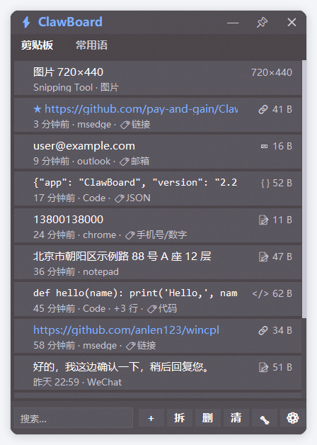
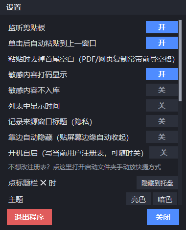
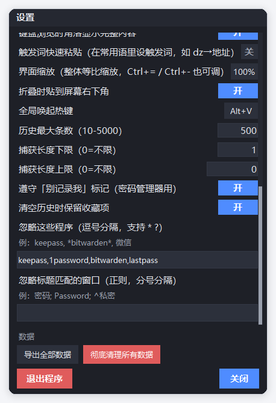

# ClawBoard

[简体中文](README.md) | **English**

> A floating clipboard history & phrases panel for Windows — zero third-party dependencies, with both a Python build (tkinter + ctypes) and a pure C build (Win32).

A lightweight clipboard history + snippets panel that sits in a corner of your screen: search, text transforms, batch export, quick paste, plus a full set of privacy-oriented clipboard handling.

<p align="center">
  
</p>

<p align="center">
  
  
</p>

## ✨ Features

- **Clipboard history** — auto capture, dedupe, configurable cap, starring; hover for time, right-click for details
- **Phrases** — group management, word split (turn one block of text into many phrases), full CRUD
- **Advanced search** — `app:` source / `time:` / `type:` / `size:` / `is:` / `-` exclude, multi-word AND + highlighting
- **27 text transforms** — encode/decode, case, line ops, hashes (MD5/SHA1/SHA256), JSON formatting…
- **Batch export** — TXT / CSV (with BOM) / JSON / Markdown
- **Quick paste** — `Ctrl+1..9` / `Ctrl+0` pastes items 1–10 directly
- **Privacy** — honors Windows' "don't record me" flags, app/title ignore lists, sensitive-content detection and masking
- **Nice to use** — hide on screen edge, double-click to collapse to the corner, drag any edge/corner to resize, proportional UI scaling (50%–150%), custom background, light/dark themes

## 🚀 Quick start

### Just run it
Grab `ClawBoard.exe` from [Releases](../../releases) and double-click. The data file is created next to the exe.

### From source
```bash
python ClawBoard.py     # requires Python 3 + tkinter (bundled with Windows)
```

No pip dependencies. Windows 10 / 11.

### Build an exe
```bash
pip install pyinstaller
pyinstaller ClawBoard.spec
```

### C build (optional)
[`ClawBoardC/`](ClawBoardC/) is a pure Win32 + GDI implementation (~2,500 lines, 205 KB binary, ~15 MB memory),
built with `ClawBoardC/build.bat` (requires MSVC). Both builds **share the same data file** and can be swapped freely.

## ⌨️ Shortcuts

| Key | Action |
|---|---|
| `Ctrl+Shift+V` | Show / hide the panel |
| `Ctrl+1..9` / `Ctrl+0` | Quick-paste items 1–10 |
| `Ctrl+T` / `Ctrl+E` | Text transform / batch export |
| `Ctrl+F` | Focus search |
| `Ctrl+=` / `Ctrl+-` | Proportional UI scaling |
| `↑` `↓` / `Enter` | Navigate / paste |
| `Delete` | Delete selected |
| `Esc` / `Ctrl+Q` | Hide / quit |

## 📖 Documentation

🌐 **[Online docs](https://pay-and-gain.github.io/ClawBoard/)** — web version, switch between Chinese / English

| Document | Content |
|---|---|
| [Design notes](docs/DESIGN.en.md) · [中文](docs/制作思路.md) | **Features + usage guide + design thinking**: where requirements came from, method order, tech choices, implementation steps, pitfalls, measured numbers, FAQ |
| [Architecture](docs/架构设计.md) | Layers, module split, dependency direction, call flows |
| [CHANGELOG](CHANGELOG.md) | Version-by-version changes |

## 🏗️ Project layout

```
ClawBoard.py            entry point + re-export aggregation layer
clawboard/              Python package (16 responsibility modules, 4 layers)
├─ config.py            centralized config + data contracts + AppState
├─ runtime.py           runtime mutable globals (NO_SAVE etc.)
├─ theme.py             color themes
├─ classify.py          content-type classification
├─ timefmt.py           time formatting + data migration
├─ win32.py             Win32 declarations + DPI + single instance
├─ clipboard.py         clipboard read/write + sensitive detection
├─ hotkey.py            hotkey + tray (hidden message window)
├─ widgets.py           shared widgets + layout/event helpers
├─ vlist.py             virtualized scrolling list
├─ dialogs.py           settings / transform / export dialogs
└─ app*.py              main class (inherits 6 mixins)
query.py                search syntax parser
transform.py            27 text transforms
ClawBoardC/             C implementation
docs/                   design docs + screenshots
```

Dependency direction (no circular imports): `config` (leaf) → domain → system integration → UI widgets → UI orchestration → entry point.

## 🧪 Tests

```bash
python test_core.py       # search syntax (27)
python test_refactor.py   # refactor unit tests (12)
python _t14.py            # content classification (38)
python _t22.py            # toolbar layout (26)
python _t24.py            # collapse / duplicate capture (24)
python _t25.py            # edge resize (25)
python _t26.py            # UI scaling (25)
```

**177** regression tests in total, covering layout, geometry, data and interaction paths.

## 🎯 Design trade-offs

- **Zero third-party deps**: tkinter for UI, ctypes straight to Win32 for system features — no network, no dependency-version traps, copy-and-run
- **Text-only by design**: handles text clipboard only, no image/file support (keeps it simple)
- **JSON instead of SQLite**: single file, easy to back up, hand-editable; safety comes from versioned migration + atomic writes
- **Two implementations**: Python validates the complex logic, C proves how small it gets without an interpreter

## 📄 License

[MIT](LICENSE)
