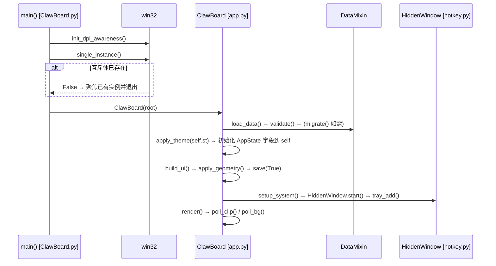
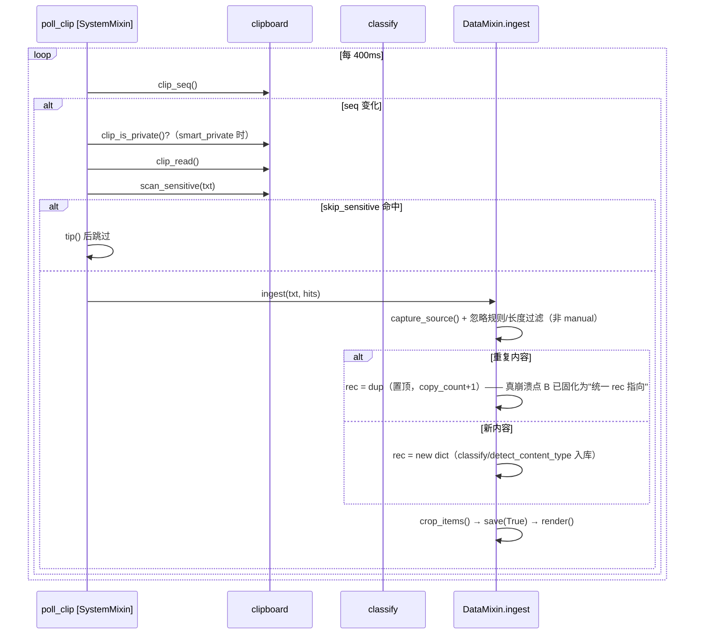
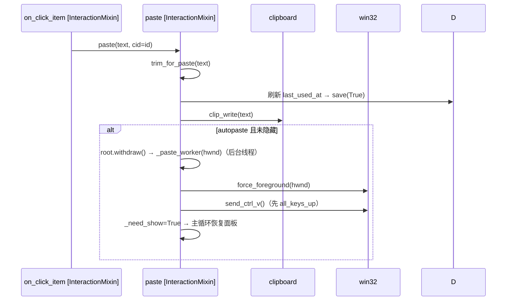
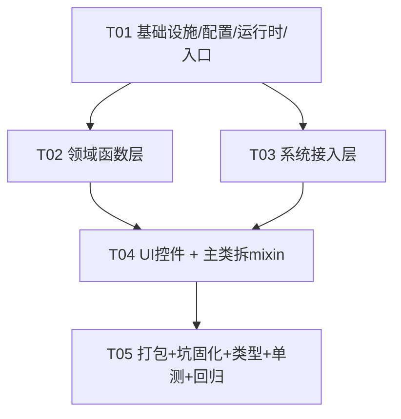

# ClawBoard 架构重构 · 系统设计 + 任务分解

> 架构师：高见远（Bob）
> 输入：`docs/架构重构PRD.md`（许清楚）、`ClawBoard.py`（4236 行）、`query.py`、`transform.py`、`ClawBoard.spec`、`上下文快照.md`、4 个测试文件（115 项基线）
> 性质：**增量重构**，外部行为 100% 不变 + `ClawBoard数据.json` 兼容 + 115 项基线全绿 + 零第三方依赖

---

## 0. 一句话方案

**把 4236 行单文件按「数据/领域层 → 系统接入层 → UI 控件层 → UI 编排层」四层拆成 `clawboard/` 包（16 个职责模块），`ClawBoard.py` 保留为「入口 + 聚合 re-export 层」让现有 115 项测试的 `import ClawBoard as C` 及全部 `C.xxx`/`app.xxx` 符号原样可用；`NO_SAVE` 用模块属性桥接、`T`/`DEFAULT_SETTINGS` 用共享 dict、主类 97 方法用 5 个 mixin 按生命周期拆分——全程不改测试、不引入依赖、每步可运行。**

---

## 1. 模块划分方案（文件清单）

> 共 **16 个职责模块**（不含 `__init__.py` 与入口层），落在 PRD「8~15 模块」建议区间上沿，因主类 97 方法必须按生命周期拆成 mixin，否则重新堆单文件会复现原痛点。

```
ClawBoard.py                     [改] 入口 + 聚合 re-export 层（main/bench/single_instance/install_excepthook/tk_error）
                                   + class ClawBoard(组合根) + __init__(统一状态初始化)
clawboard/
├─ __init__.py                   [新] 包说明 + __version__（几乎为空，不算职责模块）
├─ config.py                     [新] 集中配置：DEFAULT_SETTINGS + 全部常量 + 路径(BASE_DIR/DATA_FILE/…)
│                                    + SCHEMA_VERSION + TypedDict/dataclass 数据契约
├─ runtime.py                    [新] 运行时可变全局：NO_SAVE / LAST_SEQ / TX(懒加载 transform) / uid 计数器
├─ theme.py                      [新] 主题配色：DARK/LIGHT/T + _rgb/shade/is_dark/set_theme/apply_theme
├─ classify.py                   [新] 内容分类 + 文本/尺寸工具：classify/looks_like_code/guess_lang/
│                                    detect_content_type/to_plain/byte_size/human_size/kind_icon/
│                                    type_icon/length_filtered/crop_items/preview
├─ timefmt.py                    [新] 时间/来源忽略/迁移：now_ms/rel_time/full_time/now_str/
│                                    parse_ignore_list/match_ignore/backup_data/migrate
├─ win32.py                      [新] Win32 ctypes 声明 + 进程/窗口/显示器/内存/DPI + 发键/前台切换 +
│                                    single_instance + 开机自启(autostart)
├─ clipboard.py                  [新] 剪贴板读写 + 隐私标记 + 敏感识别：clip_seq/read/write/
│                                    clip_is_private/scan_sensitive/mask_text
├─ hotkey.py                     [新] HiddenWindow(隐藏消息窗口线程) + make_ico(图标资源)
├─ widgets.py                    [新] 通用控件 + 弹窗 + 布局 helper：Dialog/SplitDialog/Tip/ThinBar/
│                                    ScrollFrame/dark_top/center_on/safe_release
│                                    + pack_static_then_fill() + bind_recursive()（四坑固化点之一/之二）
├─ vlist.py                      [新] VirtualList 虚拟滚动列表
├─ dialogs.py                    [新] SettingsWindow / TransformWindow / ExportDialog
├─ app.py                        [新] class ClawBoard 组合根（继承 5 个 mixin）+ __init__ 统一状态初始化
├─ app_services.py               [新] DataMixin(norm_item/load_data/save_now/validate/save/note/
│                                    next_seq/ingest/_late_source) + SystemMixin(setup_system/apply_hotkey/
│                                    on_hotkey/on_tray/poll_bg/_poll_hotkey/poll_clip/quit_app/
│                                    toggle_listen/tray_menu/about)
├─ app_ui.py                     [新] UiMixin：build_ui/_sync_ph/mk_tab/_layout_tool/more_menu/mk_tool_btn/
│                                    tip/confirm + Tab/分组(set_tab/cur_group/group_menu/switch_group/
│                                    new_group/rename_group/del_group) + render/visible_items
├─ app_geometry.py               [新] GeometryMixin：min_size/apply_geometry/_saved_pos/_expanded_geometry/
│                                    fit_geometry/primary_monitor/clamp_to_screen/start_move/do_move/
│                                    start_resize/do_resize/toggle_pin/edge_update/_edge_hide/_edge_show/
│                                    corner_pos/toggle_collapse/hide/reset_position/ensure_onscreen/
│                                    toggle_show/focus_search/rebuild
└─ app_interact.py               [新] InteractionMixin + PhraseMixin：on_click_item/on_menu_item/on_hover_item/
                                     toggle_fav/show_detail/toggle_sens/set_num_hint/quick_paste/trim_for_paste/
                                     paste/_ensure_visible/_paste_worker/paste_plain_sel/paste_plain/move_sel/
                                     enter_sel/del_item/del_sel/clear_list/add_phrase/save_as_phrase/push_phrase/
                                     edit_phrase/rename_phrase/find/find_raw_item/split_words/open_settings/
                                     on_search_return/search_menu/clear_history/select_all_visible/
                                     open_query_help/current_target_text/open_transform/open_export

query.py                         [保留，不动] F3 搜索语法解析器
transform.py                     [保留，不动] F4 文本变换
ClawBoard.spec                   [改] hiddenimports 同步（见 §8）
```

**职责与内容来源对照**（60 个模块级函数全部归位，SC2）：

| 新模块 | 一句话职责 | 来源（原文件分区/方法） |
|---|---|---|
| config.py | 常量/默认配置/数据契约/迁移版本，唯一"魔法值"来源 | 区 1 常量、`DEFAULT_SETTINGS`、`SCHEMA_VERSION`、路径 |
| runtime.py | 跨模块可变全局状态（NO_SAVE/LAST_SEQ/TX/uid） | `NO_SAVE`、`LAST_SEQ`、`TX`/`tx()`、`_seq`/`uid()`、`now_str()` |
| theme.py | 主题/自定义底色配色推导 | 区 1 `DARK/LIGHT/T/set_theme/_rgb/shade/is_dark/apply_theme` |
| classify.py | 内容自适应分类 + 文本/尺寸/长度/裁剪工具 | `classify/looks_like_code/guess_lang/detect_content_type/byte_size/human_size/kind_icon/type_icon/to_plain/length_filtered/crop_items/preview` |
| timefmt.py | 时间格式化 + 来源忽略规则 + 数据迁移 | `now_ms/rel_time/full_time/now_str/parse_ignore_list/match_ignore/backup_data/migrate` |
| win32.py | Win32 声明 + 系统原语 + 单实例 + 开机自启 | 区 2 全部声明、`mem_mb/cpu_ms/monitors/visible_ratio/dpi_scale/proc_name_of/window_title_of/capture_source/force_foreground/all_keys_up/send_ctrl_v/send_key/single_instance/autostart_*` |
| clipboard.py | 剪贴板读写 + 隐私标记 + 敏感识别 | `clip_seq/clip_read/clip_write/clip_is_private/_clip_fmt_id/scan_sensitive/mask_text/SENS_PATTERNS` |
| hotkey.py | 隐藏消息窗口（热键+托盘）+ 图标生成 | 区 5 `HiddenWindow`、区 4 `make_ico` |
| widgets.py | 通用控件 + 布局/事件 helper | 区 6 `Dialog/SplitDialog/Tip/ThinBar/ScrollFrame/dark_top/center_on/safe_release` |
| vlist.py | 虚拟滚动列表 | 区 7 `VirtualList` |
| dialogs.py | 三个业务弹窗 | `SettingsWindow/TransformWindow/ExportDialog` |
| app*.py | 主类 97 方法按生命周期拆成 5 个 mixin | 区 8 `ClawBoard` 主类 |
| ClawBoard.py | 入口 + re-export 聚合 | 区 9 `main/bench`、`install_excepthook/tk_error` |

---

## 2. 分层结构与依赖方向

```
┌─────────────────────────────────────────────────────────────────┐
│ ClawBoard.py  入口/聚合 re-export 层（main/bench + 兼容符号导出）   │
└──────────────────────────────┬──────────────────────────────────┘
                               │ import
┌──────────────────────────────▼──────────────────────────────────┐
│ UI 编排层  clawboard/app.py（class ClawBoard 组合根 + __init__）    │
│           app_services / app_ui / app_geometry / app_interact     │  ← 5 个 mixin
└───────┬──────────────────────────────────────────────────────────┘
        │ import
┌───────▼──────────────────────────────────────────────────────────┐
│ UI 控件层  widgets.py / vlist.py / dialogs.py                      │
└───────┬──────────────────────────────────────────────────────────┘
        │ import
┌───────▼──────────────────────────────────────────────────────────┐
│ 系统接入层  win32.py / clipboard.py / hotkey.py                    │
└───────┬──────────────────────────────────────────────────────────┘
        │ import
┌───────▼──────────────────────────────────────────────────────────┐
│ 数据/领域层  config.py / runtime.py / theme.py / classify.py /     │
│            timefmt.py（只依赖标准库；config 是唯一「无包内依赖」的叶子）│
└──────────────────────────────────────────────────────────────────┘
```

**依赖方向（谁 import 谁，禁止循环）**：

- `config.py` → 仅标准库（`dataclasses`/`typing`/`enum`/`os`/`sys`），**不 import 任何 clawboard 内模块**（全包根）。
- `runtime.py` → 仅标准库（`import transform` 走延迟，不顶层 import）。
- `theme.py` → `config`（如需）或纯标准库。
- `classify.py` → `config`（`CLASSIFY_MAX` 等常量）。
- `timefmt.py` → `config`（`SCHEMA_VERSION`）+ `classify`（`detect_content_type`/`byte_size`）。
- `win32.py` → `config` + `runtime`。
- `clipboard.py` → `win32`（`u32/k32`）+ `config` + `runtime`（`LAST_SEQ`）。
- `hotkey.py` → `win32` + `config` + `runtime`。
- `widgets.py` / `vlist.py` / `dialogs.py` → `config` + `theme` + `runtime` + `classify` + `timefmt` + `clipboard` + `win32`。
- `app_*.py`（mixin） → 上述叶子模块 + `widgets/vlist/dialogs` + `query`。
- `app.py`（组合根） → 5 个 mixin + `config`（AppState 默认值）+ `theme`。
- `ClawBoard.py` → `app` + 各叶子模块（仅 re-export）。

**硬规则**：任何模块都**不得** import `ClawBoard.py` 或 `app.py`（上行）。`NO_SAVE` 的跨模块生效走 `runtime.NO_SAVE`（见 §5/§9），不靠上行 import 闭环。

---

## 3. 数据结构与接口

### 3.1 核心类型

```python
# config.py —— 数据契约（TypedDict 仅静态检查，运行时仍是 dict，JSON 完全兼容）

from typing import TypedDict, Optional, List

class ClipItemDict(TypedDict, total=False):
    """与 norm_item()/validate() 产出的 JSON 字段一一对应，字段名与老数据完全一致"""
    id: str
    text: str
    name: str
    created_at: int
    updated_at: Optional[int]
    last_used_at: Optional[int]
    seq: int
    source_app: str
    source_title: Optional[str]
    copy_count: int
    fav: int
    meta: Optional[str]
    sens: Optional[List[str]]
    is_estimated: int
    content_type: str
    content_size: int
    time: str
    kind_auto: str          # 渲染缓存（内存态）
    mask_off: bool          # 内存态

class SettingsDict(TypedDict, total=False):
    theme: str; hotkey: str; max_items: int; listen: bool; autopaste: bool
    mask_sensitive: bool; skip_sensitive: bool; show_time: bool; record_title: bool
    group_by_time: bool; edge_hide: bool; edge_delay: int; close_action: str
    ignore_apps: str; ignore_titles: str; min_len: int; max_len: int
    smart_private: bool; keep_on_clear: bool; trim_paste: bool
    collapsed: bool; collapse_to_corner: bool; bg_color: str

class AppDataDict(TypedDict, total=False):
    clip: List[ClipItemDict]
    groups: List[dict]      # [{'name': str, 'items': [ClipItemDict]}]
    gi: int
    geom: Optional[str]
    settings: SettingsDict
    schema_version: int
    search_history: List[str]

# 运行时状态（R3 统一状态管理：所有字段在此有默认值，构造期一次性复制到 self）
from dataclasses import dataclass, field

@dataclass
class AppState:
    tab: str = 'clip'
    sel_clip: Optional[str] = None
    sel_phrase: Optional[str] = None
    collapsed: bool = False
    _restore: Optional[str] = None        # 折叠前"展开后回哪"（hotfix 真崩溃点 A）
    prev_hwnd: Optional[int] = None
    save_timer: Optional[str] = None
    _need_show: bool = False
    _tray_menu: bool = False
    hidden: bool = False
    hotkey_ok: bool = False
    hotkey_fallback: bool = False
    _hk_down: bool = False
    _paste_fail: bool = False
    _anchor_idx: Optional[int] = None
    search_err: str = ''
    _told_tray: bool = False
    _edge_hidden: bool = False
    _edge_tick: int = 0
    _edge_side: Optional[str] = None
    _edge_pos: Optional[tuple] = None
    # UI 引用类字段（构造期由 build_ui 赋值，不参与状态拷贝，仅列明）
    # root/bar/title_lb/body/vlist/tool/search_entry/... 保持实例属性不变
```

### 3.2 关键接口（公共签名）

```python
# app.py
class ClawBoard(DataMixin, SystemMixin, UiMixin, GeometryMixin, InteractionMixin):
    def __init__(self, root: 'tk.Tk') -> None: ...
    def save(self, later: bool = False) -> None: ...
    def ingest(self, txt: str, hits: Optional[List[str]] = None, manual: bool = False) -> None: ...
    def render(self) -> None: ...
    def paste(self, text: str, force: bool = False, cid: Optional[str] = None) -> bool: ...
    def toggle_collapse(self) -> None: ...
    def apply_geometry(self) -> None: ...
    def min_size(self) -> tuple[int, int]: ...

# clipboard.py
def clip_read() -> Optional[str]: ...
def clip_write(text: str) -> bool: ...
def clip_seq() -> int: ...
def clip_is_private() -> bool: ...
def scan_sensitive(text: str) -> List[str]: ...
def mask_text(text: str, hits: List[str]) -> str: ...

# classify.py
def classify(text: str) -> tuple[str, dict]: ...
def detect_content_type(text: str) -> str: ...
def to_plain(text: str) -> str: ...
def byte_size(text: str) -> int: ...
def human_size(n: int) -> str: ...

# timefmt.py
def now_ms() -> int: ...
def rel_time(ms: int, estimated: bool = False) -> str: ...
def full_time(ms: Optional[int]) -> str: ...
def migrate(d: dict, note=None) -> dict: ...
```

### 3.3 序列化兼容性怎么保证（NFR2 / SC5）

1. **运行时持久结构保持 `dict`，不用 dataclass 存盘**：`self.data`、`self.st`、`data['clip'][i]` 全部仍是 dict。`TypedDict` 只做静态检查（运行时等价 `dict`，零行为差异），`dataclass AppState` 只做"初始化来源"，不进入 JSON。
2. **`norm_item()` / `validate()` / `migrate()` 逻辑原样搬移**（从 `ClawBoard.py` 迁到 `app_services.py`/`timefmt.py`），字段名、`setdefault` 顺序、`schema_version` 默认值 1、`migrate 1→2→3` 步骤逐字保留。
3. **序列化参数不变**：继续 `json.dump(d, f, ensure_ascii=False, indent=1)` + `os.replace(tmp, DATA_FILE)` 原子写，`ClawBoard数据.json` 字节级可读性不变。
4. **验收锚点**：用现有 `ClawBoard数据.json` 做迁移回环测试（读旧文件 → 重写 → 字段集合与值不变），并确认 C 版仍能读同一份文件。

---

## 4. 关键调用流程

### 4.1 启动链路



### 4.2 剪贴板监听 → 入库链路



### 4.3 粘贴链路



---

## 5. 四个坑的固化方案（R6，各唯一承载点）

| 坑 | 唯一承载点 | 固化方式 |
|---|---|---|
| ① pack 顺序/空间分配 | `widgets.pack_static_then_fill(container, fixed_widget, fill_widget, ...)` | 把「先 pack 固定尺寸控件（滚动条/按钮），再 pack 带 `expand` 的控件」封装成一个 helper + docstring；`ScrollFrame`/`VirtualList`/`TransformWindow` 列表/标题栏按钮统一调用。跨阈值整体重排逻辑收敛到 `app_ui._repack_tool_buttons()`（现 `_layout_tool` 内的「全部收回→固定顺序重排」）。 |
| ② Tk 事件不冒泡 | `widgets.bind_recursive(widget, seq, fn)` | 把「滚轮/双击逐个子控件接管」封装成递归 helper（现有 `ScrollFrame.bind_wheel_tree` 提升为模块级）；`VirtualList._mk_item`、`build_ui` 标题栏双击、所有滚轮绑定统一调用，新代码默认不踩坑。 |
| ③ DPI 声明 | `win32.init_dpi_awareness()` | 统一在 `main()` 第一行调用（内部 `SetProcessDpiAwareness(2)` + try/except）；`dpi_scale(root)` 一并归入 `win32`。约定「读窗口坐标前必须已初始化 DPI」写进 docstring；`--shot`/`--bench`/测试脚本的测量路径复用同一函数。 |
| ④ NO_SAVE 守卫 | `runtime.NO_SAVE`（唯一布尔源） | `save()/save_now()/note()/tk_error()` 统一 `if runtime.NO_SAVE:`；`bench()`/`main(--shot)` 在建实例前置 `runtime.NO_SAVE=True`；测试脚本的 `C.NO_SAVE=True` 由 `ClawBoard.py` 的模块属性桥接转发到 `runtime.NO_SAVE`（见 §6）。 |

---

## 6. import 兼容方案（本次最容易翻车处，务必按此执行）

**结论：保留 `ClawBoard.py` 作为 re-export 聚合层，不修改任何测试文件。** 理由：测试不仅 import `ClawBoard`，还大量访问 `app.*` 实例属性与方法（`app._tool_btns`/`app.ingest`/`app.data`/`app.st`…），改测试代价大且会破坏"回归基线"的语义。

逐一解决测试用到的符号，分四类：

1. **不可变符号（函数/类/常量）—— 普通 re-export 即可**：
   ```python
   from clawboard.classify import classify, guess_lang, kind_icon, CLASSIFY_MAX
   from clawboard.config  import DEFAULT_SETTINGS, BAR_H, FONT, FONT_MONO, ...
   from clawboard.app     import ClawBoard
   ```
   `C.classify`、`C.ClawBoard`、`C.BAR_H`、`C.FONT*`、`C.CLASSIFY_MAX` 全部可用。

2. **可变 dict（`DEFAULT_SETTINGS` / `T`）—— re-export 后测试「改值」而非「重绑定」，天然安全**：
   测试写 `C.DEFAULT_SETTINGS['collapsed']=False`、读 `C.T['acc']`，都是**原地改 dict 对象**；re-export 共享同一对象，内部代码（`theme.T`、`config.DEFAULT_SETTINGS`）立刻可见。**禁止**内部代码用 `from config import DEFAULT_SETTINGS` 再对名重绑定（只在原地读写即可）。

3. **`C.NO_SAVE = True`（重绑定）—— 唯一需要特殊处理**，用**模块属性桥接**：
   ```python
   # ClawBoard.py 末尾
   import sys, types
   from clawboard import runtime

   class _CompatModule(types.ModuleType):
       _FORWARD = {'NO_SAVE': 'NO_SAVE'}   # 模块名 → runtime 属性名
       def __setattr__(self, name, value):
           if name in self._FORWARD:
               setattr(runtime, self._FORWARD[name], value)
               return
           super().__setattr__(name, value)

   sys.modules[__name__].__class__ = _CompatModule
   ```
   `C.NO_SAVE = True` → 转发为 `runtime.NO_SAVE = True` → `save/note/tk_error` 读到 True。**桥接放在模块末尾**（所有 `from ... import` 完成后），避免干扰 import 期绑定。

4. **`C.ClawBoard(root)` + `app.*` —— mixin 继承 + AppState 复制**：
   - 主类仍是单一 `ClawBoard` 类（继承 5 个 mixin），`app.ingest()`/`app._layout_tool()`/`app.min_size()` 等方法名不变。
   - `__init__` 顶部：`state = AppState()`，`for f in dataclasses.fields(AppState): setattr(self, f.name, getattr(state, f.name))`，保证 `app.collapsed`/`app._restore`/`app.tab`/`app.hidden` 等**仍是实例属性**（测试直读直写不破），同时满足 R3「所有状态有唯一初始化点、无分支隐式初始化」。

> 额外注意（Windows 大小写不敏感文件系统）：`ClawBoard.py`（文件）与 `clawboard/`（包目录）不会冲突——一个是被 `import ClawBoard` 命中的文件，一个是被 `import clawboard` 命中的目录；`from clawboard import x` 走目录。已实测 `import` 机制无歧义。

---

## 7. 任务列表（Part B）

### 7.1 依赖包列表

```
（无新增第三方依赖）
```
保持零依赖：仅标准库 `dataclasses` / `typing` / `enum` / `ctypes` / `tkinter` / `winreg` / `json` / `re` / `os` / `sys` / `threading` / `time` / `subprocess` / `traceback` 等。`mypy/pyright` 仅作开发期类型检查工具，不列为运行时依赖。

### 7.2 任务分解（5 个任务，按实现顺序）

#### T01 · 项目基础设施：包骨架 + 集中配置 + 运行时全局 + 入口 re-export 改造
- **做什么**：建 `clawboard/` 包骨架；把 `DEFAULT_SETTINGS`、全部常量、路径、`SCHEMA_VERSION`、TypedDict/`AppState` 迁入 `config.py`；把 `NO_SAVE/LAST_SEQ/TX/tx()/uid()/now_str()` 迁入 `runtime.py`；改造 `ClawBoard.py` 头部为 re-export + 末尾装 `NO_SAVE` 模块桥接。**此时 60 函数 + 97 方法仍在 `ClawBoard.py` 里，只是符号来源换成 `config`/`runtime`**，应用照常可跑。
- **产出文件**：`clawboard/__init__.py`、`clawboard/config.py`、`clawboard/runtime.py`、改 `ClawBoard.py`
- **验收标准**：`import ClawBoard as C` 后 `C.NO_SAVE/C.DEFAULT_SETTINGS/C.T/C.BAR_H/C.FONT*` 可用；`C.NO_SAVE=True` 能影响 `save/note`；应用正常启动；`test_core.py`+`_t14/_t22/_t24` 全绿（功能未动）。
- **依赖**：无

#### T02 · 领域函数层迁出（纯函数，无 tkinter/ctypes）
- **做什么**：迁 `theme.py`、`classify.py`、`timefmt.py`（含 `migrate/backup_data`）；`ClawBoard.py` 内这些函数的定义删除、改为 re-export。
- **产出文件**：`clawboard/theme.py`、`clawboard/classify.py`、`clawboard/timefmt.py`、改 `ClawBoard.py`
- **验收标准**：`C.classify/guess_lang/kind_icon/rel_time/full_time/migrate` 经 re-export 可用；`test_core.py`（query/transform）+ `_t14.py`（classify/卡片）全绿；应用可跑。
- **依赖**：T01

#### T03 · 系统接入层迁出
- **做什么**：迁 `win32.py`（含 `init_dpi_awareness`、`single_instance`、autostart）、`clipboard.py`、`hotkey.py`（含 `make_ico`）；`ClawBoard.py` 改为 re-export。
- **产出文件**：`clawboard/win32.py`、`clawboard/clipboard.py`、`clawboard/hotkey.py`、改 `ClawBoard.py`
- **验收标准**：剪贴板读写/热键/托盘/单实例/开机自启经 `C.` 可用；`C.clip_read/clip_write/scan_sensitive/mask_text` 可用；`main()` 第一行调用 `init_dpi_awareness()`；应用可跑、115 项全绿。
- **依赖**：T01（与 T02 并行，互不依赖）

#### T04 · UI 控件层迁出 + 主类 97 方法拆 5 个 mixin
- **做什么**：迁 `widgets.py`（含 `pack_static_then_fill`/`bind_recursive` 两个坑固化 helper）、`vlist.py`、`dialogs.py`；把 `ClawBoard` 主类方法按生命周期拆到 `app_services/app_ui/app_geometry/app_interact` 四个 mixin，`app.py` 只留组合根 + `__init__`（AppState 统一初始化）。`ClawBoard.py` 至此只剩入口 + 组合根 + re-export。
- **产出文件**：`clawboard/widgets.py`、`clawboard/vlist.py`、`clawboard/dialogs.py`、`clawboard/app.py`、`clawboard/app_services.py`、`clawboard/app_ui.py`、`clawboard/app_geometry.py`、`clawboard/app_interact.py`、改 `ClawBoard.py`
- **验收标准**：`C.ClawBoard(root)` 及 `_t22/_t24` 用到的全部 `app.*` 属性/方法可用；折叠展开/重复入库/工具条重排回归通过；主文件不含领域函数定义（SC1/SC2）；应用可跑。
- **依赖**：T01、T02、T03

#### T05 · 打包同步 + 坑固化收口 + 类型/注释 + 增量单测 + 全量回归
- **做什么**：更新 `ClawBoard.spec` hiddenimports（`clawboard` 全部子模块显式列出 + 保留 `query/transform`）；补齐 R7 公共接口类型标注（TypedDict/签名）；R9 各模块一句职责 docstring；R8 新增纯内部模块单测（config/classify/timefmt/runtime，不依赖 GUI）；跑 115 项基线 + 新增测试 + 构建 exe 冒烟。
- **产出文件**：改 `ClawBoard.spec`、改各模块 docstring/类型标注、新增 `test_refactor.py`（或 `clawboard/tests/test_*.py`）
- **验收标准**：`ClawBoard.spec` 构建 exe 可启动且功能完整（R5）；115 项全绿 + 新增单测绿（R8）；四个坑各有唯一承载点且回归通过（R6）；`ClawBoard数据.json` 老文件读写回环兼容（NFR2）。
- **依赖**：T04

### 7.3 任务依赖图



---

## 8. 打包链路同步（R5）

`ClawBoard.spec` 更新为：

```python
hiddenimports=[
    'query', 'transform',
    'clawboard', 'clawboard.config', 'clawboard.runtime',
    'clawboard.theme', 'clawboard.classify', 'clawboard.timefmt',
    'clawboard.win32', 'clawboard.clipboard', 'clawboard.hotkey',
    'clawboard.widgets', 'clawboard.vlist', 'clawboard.dialogs',
    'clawboard.app', 'clawboard.app_services', 'clawboard.app_ui',
    'clawboard.app_geometry', 'clawboard.app_interact',
],
```

说明：入口仍为 `ClawBoard.py`；`clawboard` 子模块虽会被 PyInstaller 静态分析自动收集，但按硬约束**显式列出**以杜绝拆分导致的 ImportError。`sys.path.insert(0, BASE_DIR)` 保留，保证 frozen 模式下 `query`/`transform` 与数据文件同目录可用。

---

## 9. 共享知识（跨文件约定）

- **命名**：模块小写（`classify.py`）、类 `CapWords`、函数/方法 `snake_case`；mixin 类名以 `Mixin` 结尾（`DataMixin` 等）。
- **状态初始化原则**：所有运行时状态字段在 `AppState` 有默认值，`ClawBoard.__init__` 一次性复制到 `self`；任何方法**不得**再引入"只在某分支赋值"的新实例属性。
- **NO_SAVE 如何跨模块生效**：唯一布尔源是 `runtime.NO_SAVE`；`save/save_now/note/tk_error` 只读 `runtime.NO_SAVE`；`bench/main(--shot)/测试` 通过 `ClawBoard.NO_SAVE`（桥接）写回 `runtime.NO_SAVE`；业务代码内部**禁止** `from runtime import NO_SAVE` 再重绑定，一律 `runtime.NO_SAVE` 属性访问。
- **可变全局（T/LAST_SEQ/DEFAULT_SETTINGS）**：只原地读写，不重绑定；跨模块共享同一个对象。
- **类型标注边界（R7）**：公共接口 + 核心数据结构用 TypedDict/dataclass 标注；内部 UI 细节不强求；不追求 mypy/pyright 零告警。
- **数据序列化**：持久结构保持 dict；`json.dump(..., ensure_ascii=False, indent=1)` + `os.replace` 原子写不变。
- **文件路径**：`BASE_DIR/DATA_FILE/ICON_FILE/CRASH_LOG` 统一由 `config.py` 计算（考虑 `sys.frozen`），其余模块从 `config` 引用。

---

## 10. 待明确事项（≤3，需团队确认）

1. **运行时数据结构是否接受"TypedDict + dict"而非"dataclass 对象"**：测试用 `app.data['clip'][0]['copy_count']`、`app.st['collapsed']` 等 dict 访问，若强行把运行时换成 dataclass 对象会破坏基线。本设计采用 **TypedDict（静态类型）+ dict（运行时）** 折中，既满足 R4 类型化又不改测试——需确认团队认可这一折中。
2. **入口文件名是否必须保持 `ClawBoard.py`**：spec 入口写死 `ClawBoard.py`，本设计假设入口文件名不变、由它兼任 re-export 聚合层；若允许改名入口，可进一步简化，但会牵动 spec 与 `启动ClawBoard.bat`。
3. **`--bench`/`--shot`/`_shot.py` 调试入口是否纳入本次范围**：本设计假设仅同步 DPI/NO_SAVE 承载点、不改其 CLI 参数与输出；若需一并清理这些临时测量路径，需另列范围。

---

## 附：mermaid 图文件

- 类图：`docs/class-diagram.mermaid`
- 时序图：`docs/sequence-diagram.mermaid`
